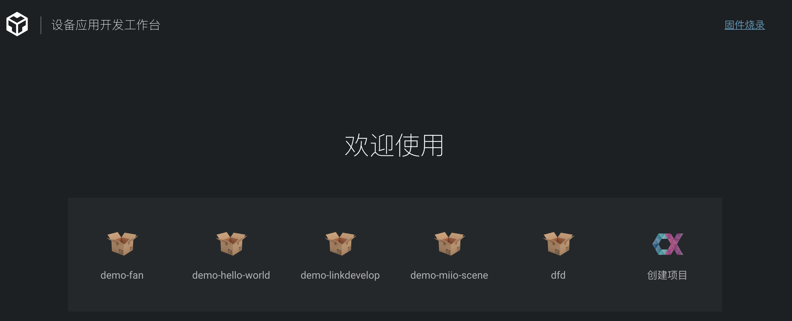
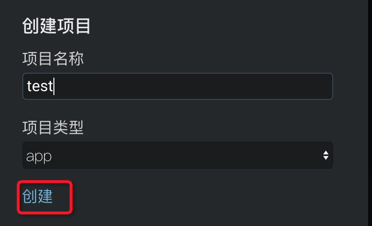
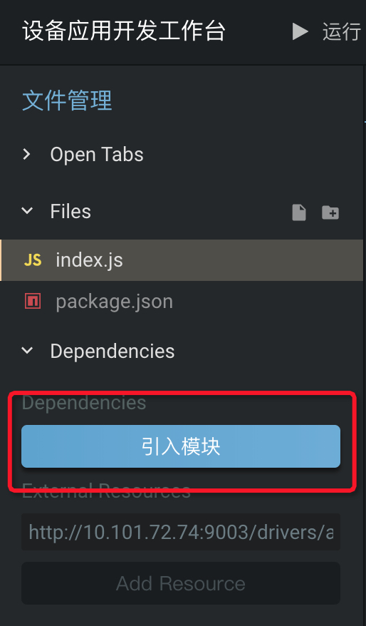
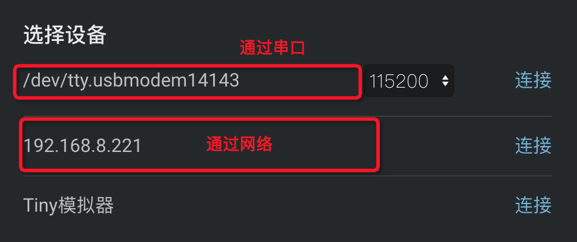

# TinyEngine JavaScript应用开发五步曲

[目录]

[准备工作](#准备工作)

​	[1）选取目标运行环境](#选取目标运行环境)

​	[2) 打开TinyEngine嵌入式应用开发控制台](#打开tinyengine嵌入式应用开发控制台)

[第一步 创建新工程](#第一步-创建新工程)

[第二步 导入驱动和软件模块](#第二步-导入驱动和软件模块)

[第三步 应用程序开发](#第三步-应用程序开发)

[第四步 连接需要调试的设备](#第四步-连接需要调试的设备)	

[第五步 在设备端运行已经开发的应用](#第五步-在设备端运行已经开发的应用)


**文档说明**： 

本文档适用于基于TinyEngine开发JavaScript应用的开发者，文中将一步一步说明如何开启TinyEngine的JS应用开发之旅。


## 准备工作

#### 选取目标运行环境

TinyEngine JavaScript应用可运行在嵌入式模组/芯片上，如乐鑫的ESP32，AliOSThings的Developerkit开发板（具体支持型号请参考官网详情）等。为了能让开发者快速简单的入门TinyEngine和调试应用。TinyEngine JavaScript应用也可以运行在PC虚拟设备上，开发者只需在控制台界面上选择目标为虚拟设备即可。

* 目标运行环境为 一款嵌入式设备

  如果是一块实际的嵌入式设备，请在应用开发前确认烧录了对应芯片/模组的 TinyEngine固件。

  **如果该嵌入式设备已经烧录了TinyEngine最新固件，即支持了TinyEngine系统，则无需再次烧录了。**

  烧录固件的方法请参考 docs目录的《xxx芯片烧录指南》。

* 目标运行环境为 虚拟设备（即PC模拟环境）

  无需烧录固件，直接使用，当前支持Windows、MAC、Ubuntu等主机环境。

  

####  打开TinyEngine嵌入式应用开发控制台

点击 阿里云IOT一站式开发平台的嵌入式应用开发控制台，进入TinyEngine的图形化IDE开发界面。

LinkDevelop介绍：https://linkdevelop.aliyun.com/developGuide#index.html

```待补充如何通过LD进入TinyEngine嵌入式开发控制台?```


## 第一步 创建新工程 

1）进入应用开发工作台：$be launch 界面如下：  


2）选择创建项目：     填写创建的工程名，工程类型，点击创建按钮     




3）进入工程开发的工作台：  


## 第二步 导入驱动和软件模块

  


## 第三步 应用程序开发

默认创建的工程里面只有一句` console.log("Welcome TinyEngine"). `您可以在这里实现通过js代码实现你的功能。 


## 第四步 连接需要调试的设备 

 可以选择通过串口或者网络跟设备连接。  




## 第五步 在设备端运行已经开发的应用  

 点击 运行 按钮，可以将js程序更新到设备中，并将运行结果在控制台输出。 


